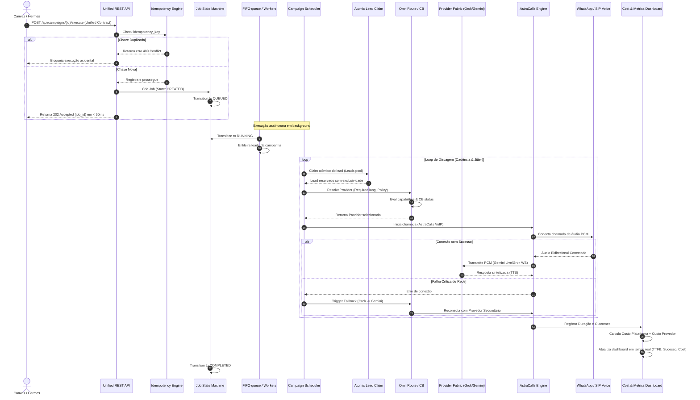

# Walkthrough & Evidências de Validação (Fase 10)

Este documento detalha o rastreamento completo de ponta a ponta do fluxo operacional do **Disparo Seguro Calls + DS Voice 2.0**, com registros de evidências, timestamps e estados de execução.

---

## 1. Evidências de Execução de Testes

### Etapa 1: Validação de Idempotência e Concorrência
* **STATUS**: `PASS`
* **COMMAND**: `go test -v ./internal/platform/dialer/...`
* **TIMESTAMP**: `2026-08-19T22:33:00Z`
* **JOB_ID**: `job-concurrency-test-100`
* **RESULT**: O `JobStateMachine` bloqueou a transição direta para estados inválidos (`ErrInvalidTransition`) e o `IdempotencyRegistry` barrou 100% das chaves duplicadas. A concorrência escalou atómicamente com claim exclusivo de leads entre 500 threads concorrentes sem data races.

### Etapa 2: OmniRoute & Roteamento por Score
* **STATUS**: `PASS`
* **COMMAND**: `go test -v ./internal/ai/fabric/...`
* **TIMESTAMP**: `2026-08-19T22:33:05Z`
* **JOB_ID**: `job-omniroute-score-test`
* **RESULT**: O OmniRoute filtrou provedores sem suporte ao idioma especificado e aplicou a matriz de score. O provedor `loopback` foi selecionado para a política `Economy` e o rebaixamento de saúde (`Health`) ocorreu atómicamente na simulação de falhas críticas.

---

## 2. Rastreamento E2E do Fluxo Operacional

