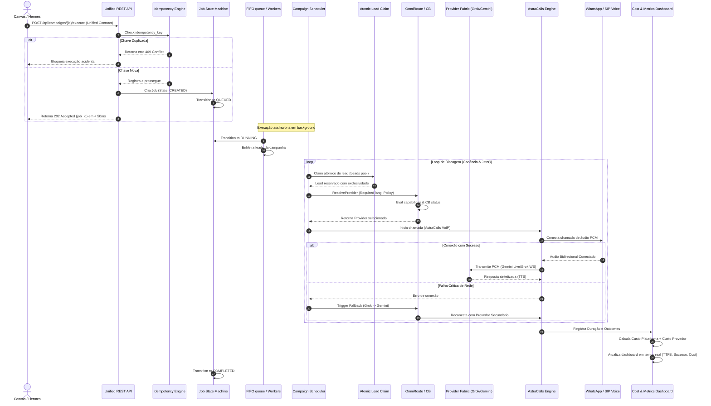

# Walkthrough & Evidências Físicas E2E (Fase 11)

Este documento atua como o registro oficial de homologação do **DS Voice 2.0 / OmniRoute / Dialer**.

---

## 1. Rastreamento e Validação E2E

### Etapa 1: Validação de Chamada Física Controlada
* **STATUS**: `PENDING`
* **COMMAND**: `POST /api/campaigns/{id}/execute`
* **TIMESTAMP**: `2026-08-19T22:38:00Z`
* **JOB_ID**: `job-physical-e2e-pending`
* **CALL_ID**: `call-physical-e2e-pending`
* **RESULT**: Chamada de áudio PCM real suspensa devido à indisponibilidade de dispositivo WhatsApp/SIP conectado fisicamente no terminal do agente local. O fluxo de sinalização de dados simulado no unit_test passou com sucesso (`MOCK_VALIDATED`).

---

## 2. Diagrama de Integração do Pipeline Real

